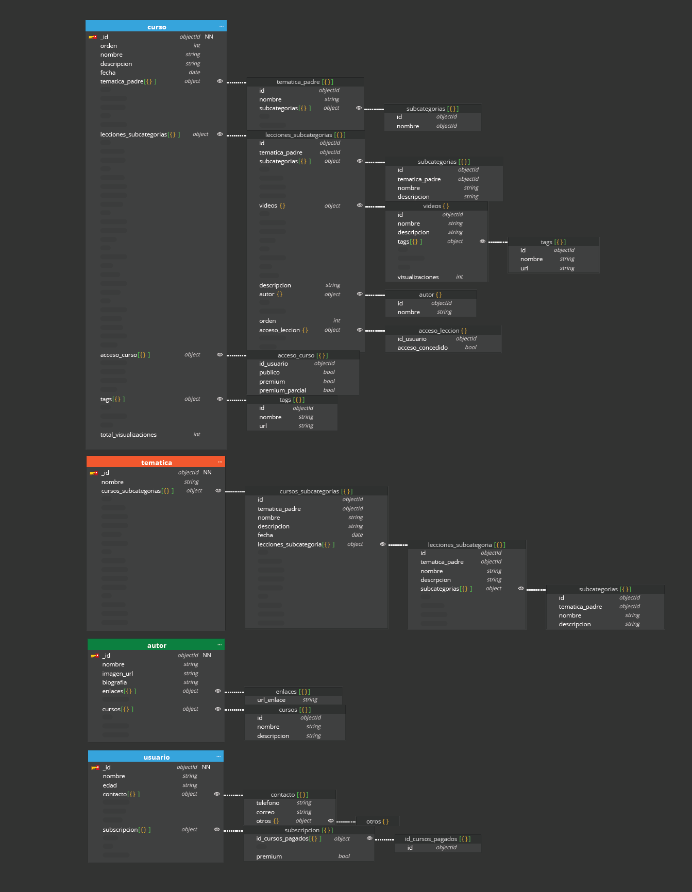

# laboratorio 01 - modelado

## caso opcional y desafío

He añadido cinco campos nuevos a la colección de **curso**, un campo nuevo al documento de **lecciones (curso >> lecciones)**, y dos campos nuevos al documento de **video (curso>>lecciones>>video)**. También he añadido una colección nueva llamada **usuario** para completar los requerimientos del modelado opcional y el desafio. Las justificación es la que sigue:

El primer enunciado *"Tener un sólo nivel de áreas es limitado, lo suyo sería tener una estructura jerárquica"* se satisface añadiendo el campo **ancestros** e **hijos**, que son arrays donde se registrarán los nodos de los que desciende, y lo que descienden de dicho curso. Esta aproximación combinada del tree pattern pretende facilitar el poder conocer a qué área o subárea pertenece un curso especifico de forma rápida en todo momento.

El segundo enunciado *"Van a haber videos públicos y privados [..., y mixtos]"* se satisface añadiendo el campo **acceso al curso** en la colección de **curso**. Este objeto contiene el id del usuario, para conocer rápidamente su tipo de subscripción, y tres Booleanos, que funcionan como una puerta de entrada al curso. Si el curso es 100% gratuito, todos podrán acceder. Si es 100% de pago, solo podrán acceder subscriptores. Si el usuario solo está subscrito a ciertos cursos, el tercer Booleano lo cribará a través de su id. 
He añadido un campo al documento de **lecciones**, **acceso a la lección** que permite restringir el acceso a lecciones dependiendo del tipo de subscripción. Este último campo permite satisfacer también el desafio *"Podemos tener usuarios subscriptores y usuarios que compren cursos concretos"*, ya que permite cribar a qué lecciones puede o no puede acceder cada usuario en todo momento
Dentro de la nueva colección **usuario** hay un campo llamado **tipo de subscripción**. Es un string que funciona únicamente a título informativo.

Ante el desafío *"Podríamos añadir una nube de tags en cada curso o video que permitiera hacer búsquedas rápidas"*, he añadido un campo **tag** a la colección **curso**, y también al documento **video**, para poder acceder a ellos rápidamente desde el buscador de la página.

Ante el desafío *"Queremos mostrar al usuario cuantas visualizaciones ha tenido un video, no hace falta que este dato este en tiempo real calculado"*, he añadido un contador de visualizaciones, tanto en el documento **video**, para registrar las visualizaciones de un video concreto, como en la colección **curso**, donde se registrará el total de visualizaciones que han tenido los videos de un curso específico. De esta forma se responde al último desafío : *"Queremos mostrar al usuario cuantas visualizaciones han tenido todos los videos de un curso, no hace falta que este dato este en tiempo real calculado"*. Para que las visualizaciones no se calculen en tiempo real, se establecerá un computed pattern que haga un conteo en batch, una vez cada 6 horas.